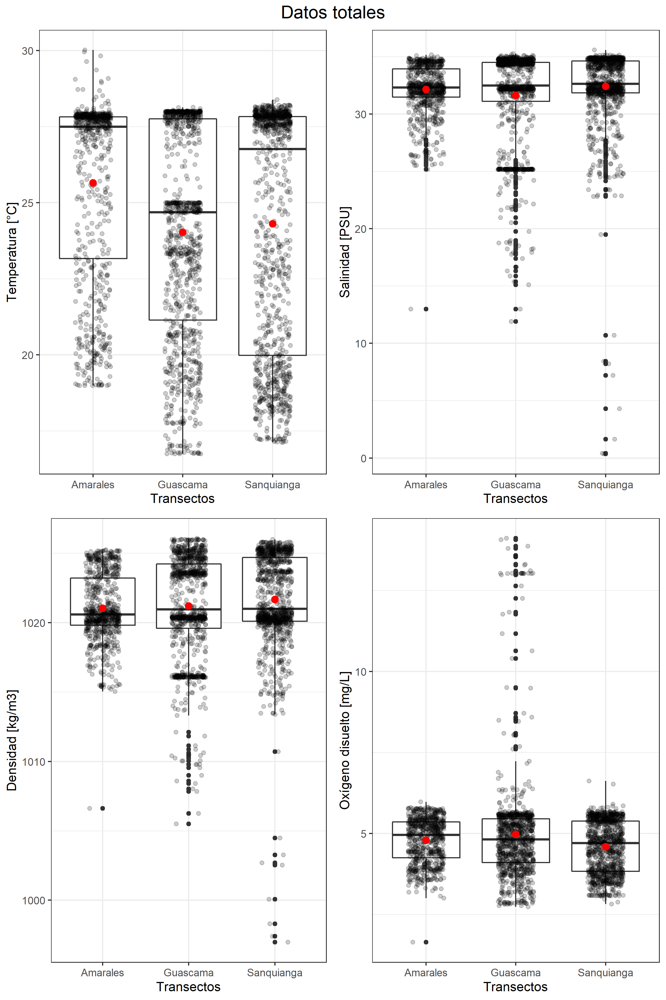

# Análisis Exploratorio de Datos.

## Análisis de los datos tomados con el CTDO - SEABIRD v.19.PLUS

Las variables tomadas con el CTDO en cada transecto fueron las siguientes: Temperatura [$°C$], Salinidad [$PSU$], Densidad del agua [$kg/m^3$] y Oxígeno disuelto [$mg/L$].

    

    

    

