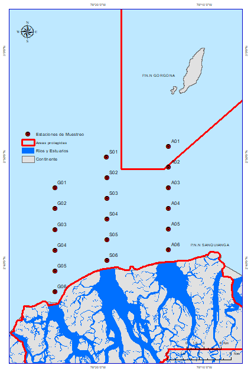

### En este repositorio se presentan los scripts del análisis del proyecto "Diversidad, abundancia y distribución del ictioplancton y su relación con las condiciones oceanográficas y los períodos mareales en la subregión Sanquianga-Gorgona, frente al delta del río Patía".

    

